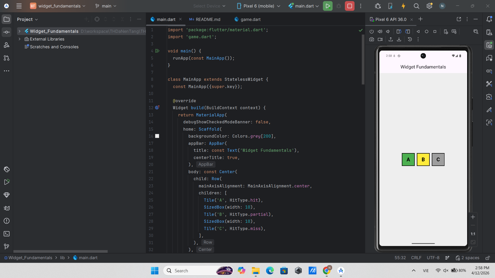

# Widget Fundamentals

Đây là bài thực hành làm quen với các widget cơ bản trong Flutter.

Trong bài này, em đã tìm hiểu và sử dụng một số widget như:
- Text
- Row
- Column
- Container
- Scaffold

Mục tiêu của bài là hiểu cách xây dựng giao diện cơ bản trong Flutter.

## 📸 Hình ảnh demo

