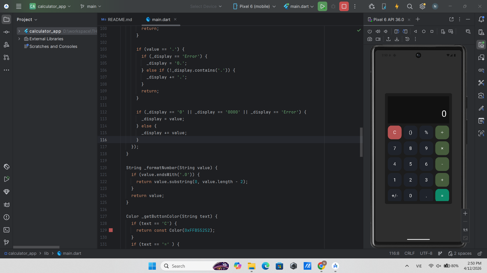

# Calculator App

Đây là ứng dụng máy tính đơn giản được xây dựng bằng Flutter.

Ứng dụng cho phép thực hiện các phép tính cơ bản như:
- Cộng (+)
- Trừ (-)
- Nhân (×)
- Chia (÷)

Giao diện được thiết kế đơn giản, dễ sử dụng.

## 📸 Hình ảnh demo

