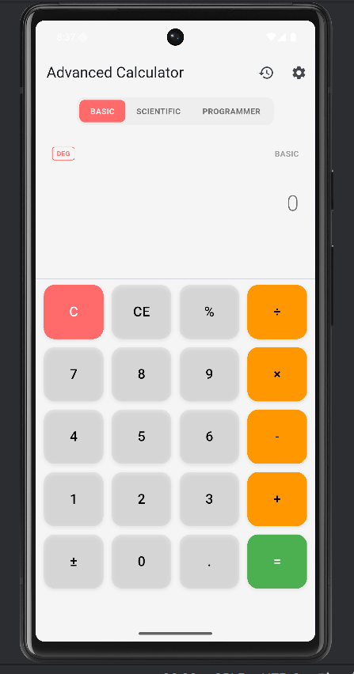
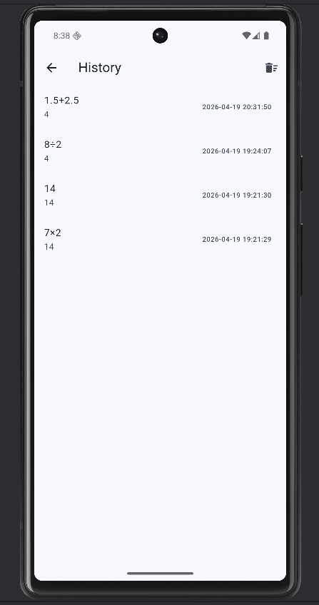
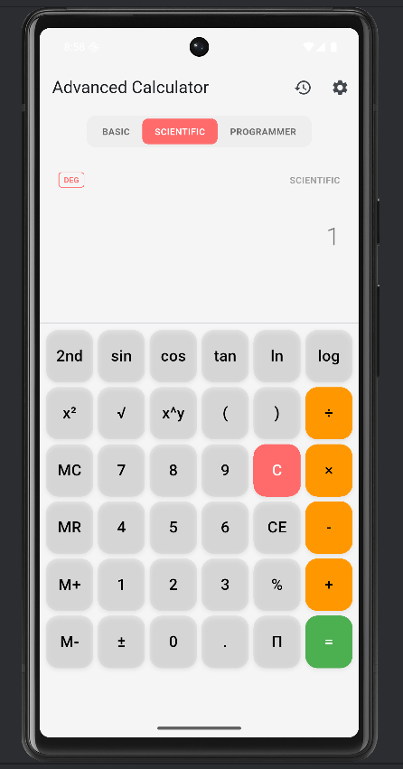
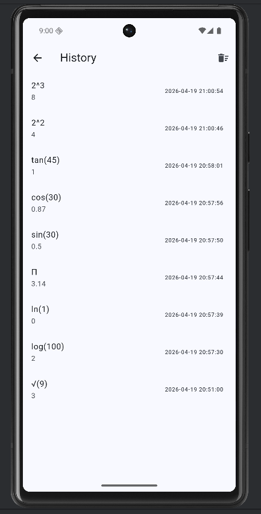
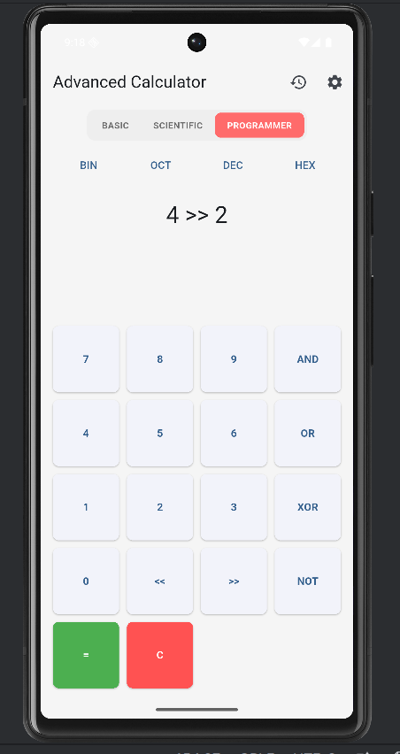
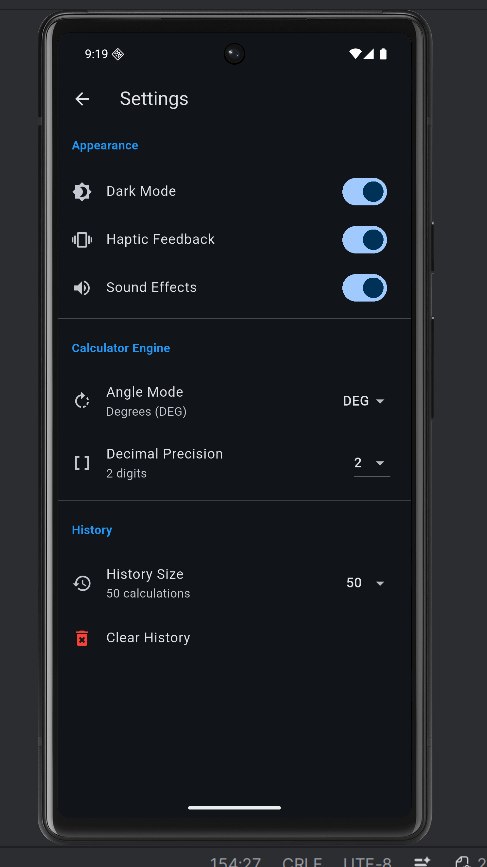
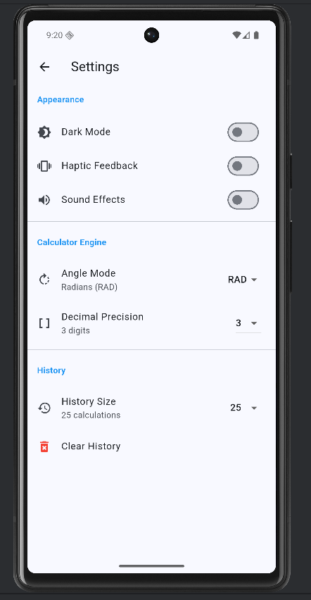

# 📱 Ứng dụng Máy Tính Nâng Cao (Advanced Calculator)

## 📌 Giới thiệu

Đây là ứng dụng **Máy tính nâng cao** được phát triển bằng Flutter, hỗ trợ nhiều chế độ tính toán và các chức năng chuyên nghiệp.

Ứng dụng giúp người dùng:

* Thực hiện các phép tính cơ bản và nâng cao
* Sử dụng các hàm khoa học
* Tính toán theo chế độ lập trình (bitwise)
* Lưu lịch sử tính toán
* Tùy chỉnh giao diện và cài đặt

---

## 🚀 Chức năng chính

### 🔢 1. Các chế độ máy tính

#### ✔ Basic Mode (Cơ bản)

* Cộng, trừ, nhân, chia
* Số thập phân
* Dấu ngoặc
* Phép tính cơ bản
### Basic Mode




#### ✔ Scientific Mode (Khoa học)

* Hàm lượng giác: sin, cos, tan
* Logarit: log, ln
* Lũy thừa: x², xʸ
* Căn bậc hai: √
* Hằng số: π, e
### Scientific Mode



#### ✔ Programmer Mode (Lập trình)

* Phép toán bit: AND, OR, XOR, NOT
* Dịch bit: <<, >>
* Chuyển hệ số: BIN, OCT, DEC, HEX

### Programmer Mode



### 💾 2. Bộ nhớ (Memory)

* M+: Cộng vào bộ nhớ
* M-: Trừ khỏi bộ nhớ
* MR: Lấy giá trị bộ nhớ
* MC: Xóa bộ nhớ

---

### 📜 3. Lịch sử (History)

* Lưu các phép tính trước đó
* Hiển thị thời gian
* Lưu trữ bằng SharedPreferences

---

### ⚙️ 4. Cài đặt (Settings)

* Dark Mode / Light Mode
* Độ chính xác số thập phân
* Chế độ góc (DEG / RAD)
* Haptic Feedback (rung)
* Sound Effects (âm thanh)
* Xóa toàn bộ lịch sử
### Settings


---

### 🎨 5. Giao diện (UI/UX)

* Thiết kế hiện đại
* Responsive layout
* Chuyển mode mượt
* Hiệu ứng khi bấm nút

---
## 🏗️ Cấu trúc project

```plaintext
lib/
├── models/
├── providers/
├── screens/
├── widgets/
├── utils/
├── services/
└── main.dart
```

* **models**: dữ liệu (mode, history, settings)
* **providers**: quản lý state
* **screens**: giao diện chính
* **widgets**: các thành phần UI
* **utils**: xử lý logic tính toán
* **services**: lưu dữ liệu

---

## ⚙️ Cài đặt và chạy

### 1. Clone project

```bash
git clone https://github.com/TrongNhanWork/flutter_advanced_calculator_trongnhan.git
```

### 2. Vào thư mục project

```bash
cd flutter_advanced_calculator_trongnhan
```

### 3. Cài thư viện

```bash
flutter pub get
```

### 4. Chạy ứng dụng

```bash
flutter run
```

---

## 🧪 Kiểm thử (Testing)

### ✔ Basic

* 1 + 1 = 2
* (5 + 3) × 2 = 16

### ✔ Scientific

* sin(45°) + cos(45°) ≈ 1.414
* √(9) = 3

### ✔ Biểu thức phức tạp

* (5 + 3) × 2 - 4 ÷ 2 = 14
* ((2 + 3) × (4 - 1)) ÷ 5 = 3

### ✔ Memory

* 5 M+ 3 M+ MR = 8

### ✔ Programmer

* 5 AND 3 = 1
* 8 >> 1 = 4


## 👨‍💻 Thông tin sinh viên

* Họ tên: Trọng Nhân
* Môn học: Lập trình di động
* Đề tài: Advanced Calculator
